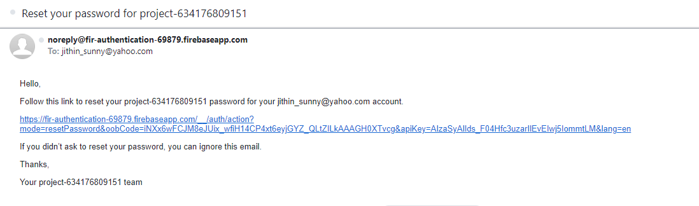

# Firebase Authentication: Sign Up and Login Project

## Overview
This project demonstrates how to use Firebase Authentication for a sign up and login system.

The project contains the following files:

* `index.html` - the main HTML file with the Login / Signup form
* `index.css` - the css file for the main HTML Page
* `index.js` - the JavaScript code for Firebase Authentication
* `firebase.js` - the Firebase Credentials 
* `welcome.html` - the page that is displayed after successful login
* `welcome.js` - the JavaScript code for welcome page with a button to logout

# Project Screenshots

## Signup / Login Page

## Welcome Page on Successful Login

## Password Reset Email

# Technology stack

1. **Frontend**: 
	* HTML 
	* CSS 

2. **Backend**: 
	* JavaScript

3. **Database / Authentication**: 
	* Firebase

# How to Run the Project

To run the project, simply open the `index.html` file in a web browser. The project requires an internet connection to connect to Firebase Authentication.

# Conclusion

This project demonstrates how to implement Firebase Authentication for Login and Signup using JavaScript. You can use this as a starting point for your own authentication implementation.

